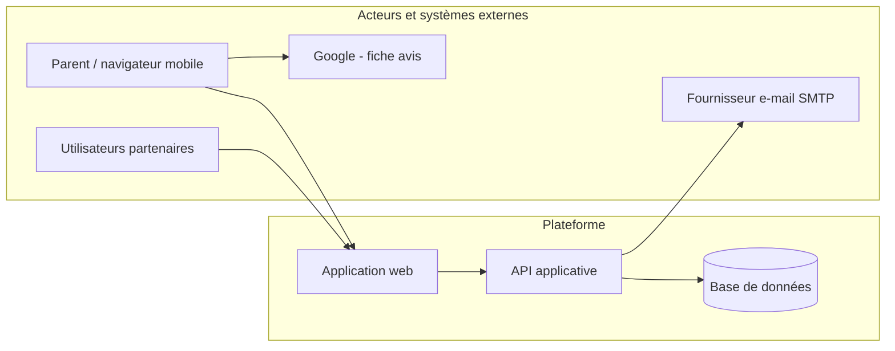
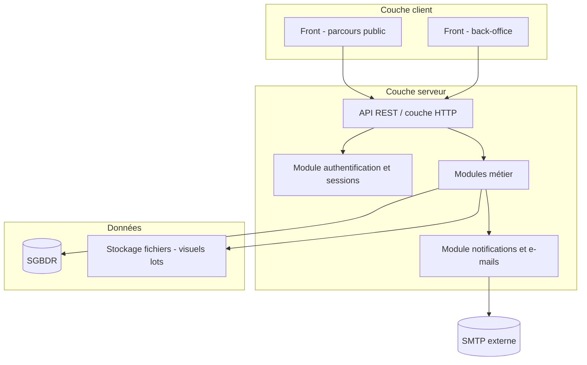
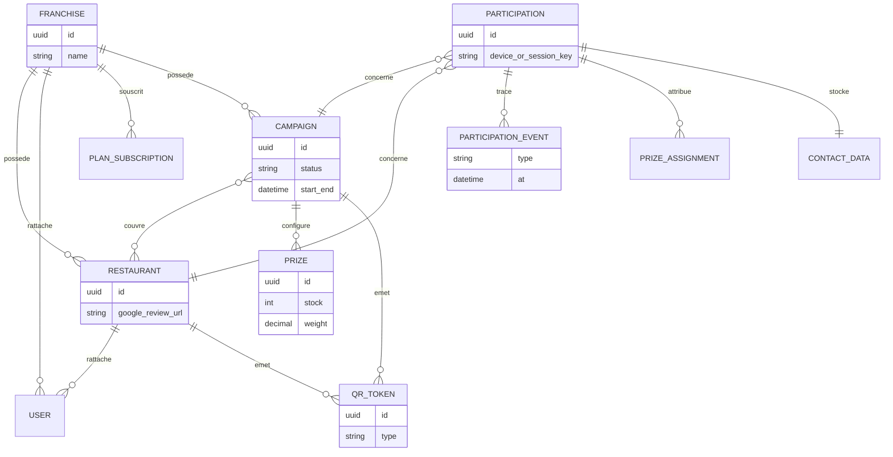

# Conception générale — Spécifications d’architecture logicielle

| Document | Valeur |
| :--- | :--- |
| **Version** | 1.1 |
| **Statut** | Spécification d’architecture générale |
| **Référence besoin** | `03-Cahier-des-charges-v2.md` |
| **Date** | 8 avril 2026 |

---

## 1. Objet et portée

### 1.1 Objet

Ce document fixe l’**architecture générale** du logiciel : découpage en sous-systèmes, principes structurants, flux majeurs, données à persister, sécurité et déploiement cible. Il sert de base à la **conception détaillée** (API, modèle physique, maquettes) et à l’implémentation.

### 1.2 Hors périmètre de ce document

- Choix d’implémentation fins (nommage des endpoints, schéma SQL complet, maquettes UI).
- Procédures d’exploitation détaillées (runbooks, sauvegardes planifiées) — esquisse en §8 uniquement.

---

## 2. Principes directeurs

| Principe | Justification (lien CDC) |
| :--- | :--- |
| **Séparation parcours public / back-office** | Parent non authentifié vs partenaires authentifiés avec rôles (§4, §5 CDC). |
| **Isolation par franchise** | Données d’une franchise inaccessibles aux autres (§4 CDC). |
| **Logique métier côté serveur** | Tirage roue, stocks, règles QR et droits ne peuvent pas reposer sur le seul client. |
| **Traçabilité événementielle** | Scans, ouverture lien Google, participation avis, complétion — pour statistiques et recette (§5–7 CDC). |
| **HTTPS partout** | Exigence de sécurité CDC §6. |

---

## 3. Vue contexte (niveau système)



- **Application web** : livre l’interface publique (parcours QR → roue → formulaire) et l’espace connecté (dashboard par rôle).
- **API applicative** : expose les opérations métier, l’authentification des partenaires et la persistance.
- **Base de données** : stockage relationnel des entités métier, événements de traçabilité et comptes utilisateurs.
- **Google** : ouverture du lien public vers la fiche « avis » (hors intégration API Google en MVP).
- **SMTP** : envoi des e-mails transactionnels (compte, reset mot de passe, alertes selon paramétrage).

---

## 4. Vue conteneurs (architecture logique)



### 4.1 Couche client

| Élément | Rôle |
| :--- | :--- |
| **Front — parcours public** | Pages ou application légère responsive : résolution contexte QR, roue (affichage), enchaînement avis → formulaire ; échange avec l’API via identifiants de session anonyme ou jetons éphémères pour une participation. |
| **Front — back-office** | Interface authentifiée : modules Utilisateurs, Communication, Gestion, Opérations, Analyse (structure CDC §5.3). |

*Remarque : une seule base de code front (monorepo ou framework unique) avec routage « public » vs « admin » est possible ; la séparation logique reste obligatoire.*

### 4.2 Couche serveur

| Élément | Rôle |
| :--- | :--- |
| **API** | Point d’entrée unique (REST JSON recommandé) ; validation des entrées ; codes HTTP cohérents ; pas d’accès direct à la base depuis le client. |
| **Authentification** | Inscription / connexion partenaires ; hachage des mots de passe ; sessions ou JWT avec expiration ; rattachement utilisateur → rôle → franchise / restaurant. |
| **Modules métier** | Encapsulent campagnes, lots, tirage pondéré, stocks, participations, QR, statistiques agrégées, plans d’abonnement (lecture / simulation), validation retrait. |
| **Notifications** | File ou appels asynchrones pour e-mails ; messages in-app persistés en base. |

### 4.3 Données

| Élément | Rôle |
| :--- | :--- |
| **SGBDR** | Source de vérité pour entités et événements nécessaires au reporting et à l’audit léger. |
| **Fichiers** | Stockage des visuels de lots (objets blob ou système de fichiers avec URL signées) — alternative MVP : URLs externes si hébergement externe des médias. |

---

## 5. Découpage fonctionnel serveur (modules métier)

| Module | Responsabilités principales |
| :--- | :--- |
| **Référentiel organisation** | Franchises, restaurants, liens Google, utilisateurs et rattachements (rôle Restaurant / Franchise). |
| **Campagnes & lots** | Cycle de vie campagne, configuration roue (probabilités, quantités, substitution), association aux restaurants. |
| **QR & résolution** | Génération d’identifiants uniques, résolution `(type QR + identifiant)` → contexte franchise / restaurant / campagne par défaut. |
| **Participation & parcours** | Sessions anonymes, enregistrement scan, tirage (avec transaction sur stock), étapes avis (lien ouvert + confirmation), formulaire et consentements, choix envoi / retrait. |
| **Logistique lots** | Statuts d’envoi ; passage à « remis » côté restaurant avec horodatage. |
| **Statistiques** | Agrégations ou vues : scans, participations, « participation avis », lots par statut, par restaurant / période. |
| **Plans & facturation** | Plan courant par franchise, limites, historique ou simulation (CDC §3). |
| **Messagerie** | Messages in-app, préférences d’alerte, orchestration envois e-mail. |
| **Audit** | Journal des actions sensibles (connexions, clôtures, remises de lots). |

---

## 6. Modèle de données conceptuel

Les agrégats suivants structurent la persistance (le modèle physique détaillé relève de la conception détaillée).



**Entités clés :**

- **Franchise, Restaurant, User** : hiérarchie et isolation multi-tenant.
- **Campaign, Prize** : règles de jeu et stocks.
- **QrToken** : identifiant résolvable vers le bon contexte (types restaurant / campagne / franchise selon CDC).
- **Participation** : dossier unique par parcours ; **ParticipationEvent** pour scan, ouverture lien, confirmation avis, soumission formulaire.
- **ContactData** : données personnelles et consentements (durée de conservation 24 mois — CDC §3).
- **PrizeAssignment** : lot gagné, statut logistique (à retirer, remis, préparé, expédié).

---

## 7. Sécurité et contrôle d’accès

### 7.1 Authentification

- Comptes **uniquement pour les partenaires** (Administrateur, Franchise, Restaurant). Le parent **n’a pas** de compte obligatoire pour le MVP.
- Mots de passe : hachage adaptatif (ex. Argon2id ou bcrypt), politique de complexité configurable.

### 7.2 Autorisation (RBAC)

| Rôle | Principe |
| :--- | :--- |
| **Administrateur** | Toutes ressources. |
| **Franchise** | Lecture / écriture limitées aux `restaurant_id` et `campaign_id` de sa franchise. |
| **Restaurant** | Lecture / écriture limitées à **son** restaurant (retraits, participations locales, stats locales). |

Contrôle systématique côté API : **chaque requête** porte le contexte utilisateur ; les requêtes sur listes et agrégations filtrent par `franchise_id` (et `restaurant_id` si applicable).

### 7.3 Parcours public

- Accès aux endpoints de participation via **jeton de session anonyme** ou **jeton signé** à durée de vie courte, lié au contexte QR initial.
- Tirage et validation finale : **idempotence** ou verrou pour éviter double soumission et respecter « 1 gain par QR + campagne » (CDC §3).

### 7.4 Transport et données

- **HTTPS** obligatoire en production ; en-têtes de sécurité usuels (HSTS, CSP selon contexte).
- Données personnelles : chiffrement au repos souhaitable pour champs sensibles en conception détaillée ; sauvegardes chiffrées.

---

## 8. Vue déploiement (cible type)

```mermaid
flowchart LR
  subgraph internet [Internet]
    Users[Navigateurs]
  end

  subgraph hebergement [Hébergement]
    LB[Reverse proxy TLS]
    APP[Instance(s) application + API]
    DBsrv[Serveur SGBDR]
    FS[Stockage fichiers]
  end

  Users --> LB --> APP
  APP --> DBsrv
  APP --> FS
```

- **Environnements** : au minimum **développement** et **production** ; **staging** recommandé pour recette.
- **Montée en charge MVP** : une instance applicative et une base peuvent suffire ; le dimensionnement exact est laissé à l’exploitation.

---

## 9. Flux transverses (synthèse)

### 9.1 Résolution QR et début de participation

1. Le client public appelle l’API avec l’identifiant encodé dans le QR.
2. Le serveur résout le contexte, crée ou reprend une **session de participation**, enregistre l’événement **scan**.
3. Retour : identifiants de campagne, restaurant, liste de lots disponibles (pour affichage roue).

### 9.2 Tirage et stock

1. Le client demande un tirage ; le serveur vérifie stocks, calcule le résultat pondéré, **décrémente** le stock dans une transaction ; enregistre le gain.
2. Si aucun stock : message campagne / lot de substitution selon configuration.

### 9.3 Avis Google et formulaire

1. Enregistrement événement **lien ouvert** (URL appelée ou endpoint dédié après redirection).
2. Soumission formulaire uniquement si confirmation avis cochée + preuve d’ouverture (règles CDC §5.4).

### 9.4 Retrait en restaurant

1. Utilisateur Restaurant liste les lots « à retirer » pour son établissement.
2. Action « remis » → mise à jour statut + horodatage + identifiant utilisateur.

---

## 10. Stack technique retenue

Décision pour la réalisation : **front** et **API** séparés, typage **TypeScript** des deux côtés, base **PostgreSQL**.

| Couche | Technologie |
| :--- | :--- |
| **Front** | **Next.js** (App Router) + **TypeScript** — parcours public (QR, roue, formulaire) et back-office (dashboard par rôle), rendu responsive. |
| **API** | **NestJS** + **TypeScript** — API REST, modules métier, authentification (JWT ou session), guards pour RBAC et isolation franchise / restaurant. |
| **SGBDR** | **PostgreSQL**. |
| **ORM / accès données** (côté API) | **Prisma** ou **TypeORM** — choix à figer en phase d’implémentation. |
| **Fichiers** (visuels lots, etc.) | Disque local en MVP ; stockage objet type **S3** ou compatible en production. |

**Intégration** : le front Next appelle l’API Nest en **HTTPS** ; URL de l’API via **variables d’environnement** ; **CORS** configuré côté Nest pour l’origine du front. La logique d’autorisation et les règles métier restent **côté serveur** (Nest).

Si le cours impose un autre langage ou framework, cette section est **révisée** en conséquence.

---

## 11. Traçabilité avec le cahier des charges

| Exigence CDC (résumé) | Réponse architecturale |
| :--- | :--- |
| Parcours mobile, HTTPS | Front responsive + TLS terminé au proxy. |
| Rôles Admin / Franchise / Restaurant | RBAC + filtrage multi-tenant en API. |
| QR multi-types, traçabilité | Module QR + entités `Participation` / événements. |
| Roue, stocks, substitution | Module campagnes & lots + transactions. |
| Statistiques | Requêtes agrégées ou tables de synthèse alimentées par événements. |
| RGPD, 24 mois | Données dans agrégats identifiables ; job d’anonymisation / suppression en conception détaillée. |
| Export CSV | Endpoint protégé sur vues participations / expéditions. |

---

## 12. Livrables de la phase suivante (conception détaillée)

- Schéma de base de données **physique** et migrations.
- Spécification **OpenAPI** (ou équivalent) des ressources.
- Maquettes ou design system des flux critiques.
- Diagrammes de séquence pour le tirage et la clôture de participation.

---

## 13. Historique des versions

| Version | Date | Modifications |
| :--- | :--- | :--- |
| 1.0 | 08/04/2026 | Première version — conception générale |
| 1.1 | 08/04/2026 | Stack retenue : Next.js + NestJS + PostgreSQL (§10) |
