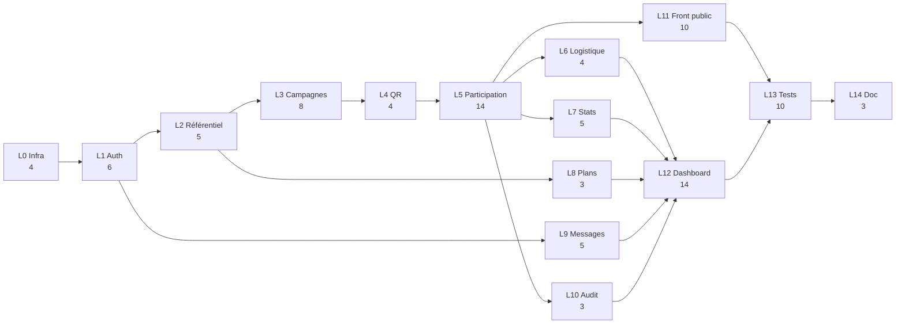

# Diagramme PERT — Projet plateforme partenaires (MVP)

| Document | Valeur |
| :--- | :--- |
| **Version** | 1.0 |
| **Références** | `06-Estimation-projet.md` (lots L0–L14) |
| **Date** | 8 avril 2026 |

---

## 1. Rappel — méthode PERT

Le **PERT** (Program Evaluation and Review Technique) modélise le projet comme un **réseau d’activités** liées par des **dépendances** (fin → début).

- **Durée** : ici en **jours-homme (JH)**, alignés sur les lots L0–L14.
- **Estimation à trois temps** (optionnelle) : pour chaque activité, durée **optimiste** *O*, **la plus probable** *M*, **pessimiste** *P* (en jours). La durée **attendue** est :

\[
t_e = \frac{O + 4M + P}{6}
\]

- **Chemin critique** : chaîne d’activités qui **fixe la durée minimale** du projet (aucune marge libre sans retarder la fin).

Les **prédécesseurs** ci-dessous traduisent une logique de développement type (API cœur avant intégration complète du dashboard).

---

## 2. Hypothèses de dépendances entre lots

| Activité | Lot | Prédécesseurs | Justification courte |
| :--- | :---: | :--- | :--- |
| L0 | Infra | — | Socle technique. |
| L1 | Auth | L0 | Sécurisation du back-office. |
| L2 | Référentiel | L1 | Franchises / restaurants / utilisateurs métier. |
| L3 | Campagnes & lots | L2 | Entités métier pour la roue. |
| L4 | QR | L3 | QR rattachés aux campagnes. |
| L5 | Participation publique | L4 | Parcours scan → formulaire. |
| L6 | Logistique | L5 | Statuts des gains. |
| L7 | Stats & exports | L5 | Agrégations sur participations. |
| L8 | Plans & facturation | L2 | Données franchise / plan. |
| L9 | Messagerie & e-mails | L1 | Comptes et envois transactionnels. |
| L10 | Audit & RGPD | L5 | Journal sur flux métiers sensibles. |
| L11 | Front parcours parent | L5 | Consomme l’API participation. |
| L12 | Front dashboard | L5, L6, L7, L8, L9, L10 | Couvre tous les modules back-office. |
| L13 | Tests & recette | L11, L12 | Intégration bout en bout. |
| L14 | Documentation | L13 | Livrable final. |

---

## 3. Durées (M) et estimation PERT à trois temps

Les durées **M** reprennent `06-Estimation-projet.md`. Pour illustrer le calcul PERT, on pose *O* = 0,75 × *M* et *P* = 1,35 × *M* (fourchette indicative ; à ajuster en atelier).

| Activité | *O* (JH) | *M* (JH) | *P* (JH) | *tₑ* (JH) |
| :--- | ---: | ---: | ---: | ---: |
| L0 | 3 | 4 | 5 | 4,0 |
| L1 | 5 | 6 | 8 | 6,2 |
| L2 | 4 | 5 | 7 | 5,2 |
| L3 | 6 | 8 | 11 | 8,2 |
| L4 | 3 | 4 | 5 | 4,0 |
| L5 | 11 | 14 | 19 | 14,3 |
| L6 | 3 | 4 | 5 | 4,0 |
| L7 | 4 | 5 | 7 | 5,2 |
| L8 | 2 | 3 | 4 | 3,0 |
| L9 | 4 | 5 | 7 | 5,2 |
| L10 | 2 | 3 | 4 | 3,0 |
| L11 | 8 | 10 | 14 | 10,3 |
| L12 | 11 | 14 | 19 | 14,3 |
| L13 | 8 | 10 | 14 | 10,3 |
| L14 | 2 | 3 | 4 | 3,0 |

**Durée attendue sur le chemin critique avec *tₑ*** : L0 + L1 + L2 + L3 + L4 + L5 + L7 + L12 + L13 + L14 = **≈ 74,7 JH** (arrondi **75 JH**). Le chemin critique reste le **même** qu’avec les durées *M* (§5).

---

## 4. Diagramme réseau PERT (vue activités — Mermaid)

Les étiquettes indiquent **code** et durée **M (JH)**. Le chemin en **gras** correspond au **chemin critique** (§5).

> **Chemin critique** : surligner manuellement la chaîne **L0 → … → L14** indiquée au §5 (Mermaid ne met pas toujours en évidence le chemin critique automatiquement).

---

## 5. Chemin critique et dates au plus tôt (*M*)

Calcul **au plus tôt** (durées **M**, fin d’activité = début + durée) :

| Activité | Durée *M* | Début au plus tôt | Fin au plus tôt |
| :--- | ---: | ---: | ---: |
| L0 | 4 | 0 | 4 |
| L1 | 6 | 4 | 10 |
| L2 | 5 | 10 | 15 |
| L3 | 8 | 15 | 23 |
| L4 | 4 | 23 | 27 |
| L5 | 14 | 27 | 41 |
| L6 | 4 | 41 | 45 |
| L7 | 5 | 41 | 46 |
| L8 | 3 | 15 | 18 |
| L9 | 5 | 10 | 15 |
| L10 | 3 | 41 | 44 |
| L11 | 10 | 41 | 51 |
| L12 | 14 | **46** | **60** |
| L13 | 10 | **60** | **70** |
| L14 | 3 | **70** | **73** |

**Début au plus tôt pour L12** = max(fin L5, L6, L7, L8, L9, L10) = max(41, 45, 46, 18, 15, 44) = **46** (imposé par **L7**).

### Chemin critique (durées *M*)

**L0 → L1 → L2 → L3 → L4 → L5 → L7 → L12 → L13 → L14**

Durée totale sur ce chemin :  
4 + 6 + 5 + 8 + 4 + 14 + 5 + 14 + 10 + 3 = **73 JH**.

Les activités **L6**, **L8**, **L9**, **L10** et **L11** ont une **marge** (chemin parallèle) : elles doivent quand même être **terminées avant L13** ; ici L11 se termine à **51** et L12 à **60**, donc **L11** est prête avant les tests d’intégration — cohérent.

---

## 6. Marge libre (aperçu)

Pour une activité *i*, **marge libre** ≈ (date au plus tôt du successeur) − (fin au plus tôt de *i*) − durée du lien (simplifié ici à la chaîne).

Exemples (durées *M*) :

- **L11** : fin = 51 ; successeur direct **L13** démarre à **60** → marge ≈ **9 JH** avant L13 (sous réserve que L12 soit le goulot).
- **L8** : fin = 18 ; n’impose pas L12 (le goulot est L7 à 46).

---

## 7. Représentation graphique classique (pour copie manuelle)

En examen ou sur papier, le PERT utilise souvent des **nœuds** (événement) ou des **flèches** (activité). Équivalent minimal **activité sur flèche** :

- Nœud début → enchaînement L0…L5 → embranchements parallèles (L6, L7, L8, L9, L10, L11) → convergence vers **L12** → **L13** → **L14** → nœud fin.

La **durée minimale du projet** (séquence critique ci-dessus) est **73 JH** en effort séquentiel sur le chemin critique (hors contingence globale du `06`).

---

## 8. Historique des versions

| Version | Date | Modifications |
| :--- | :--- | :--- |
| 1.0 | 08/04/2026 | Première version — réseau PERT, trois temps, chemin critique |
