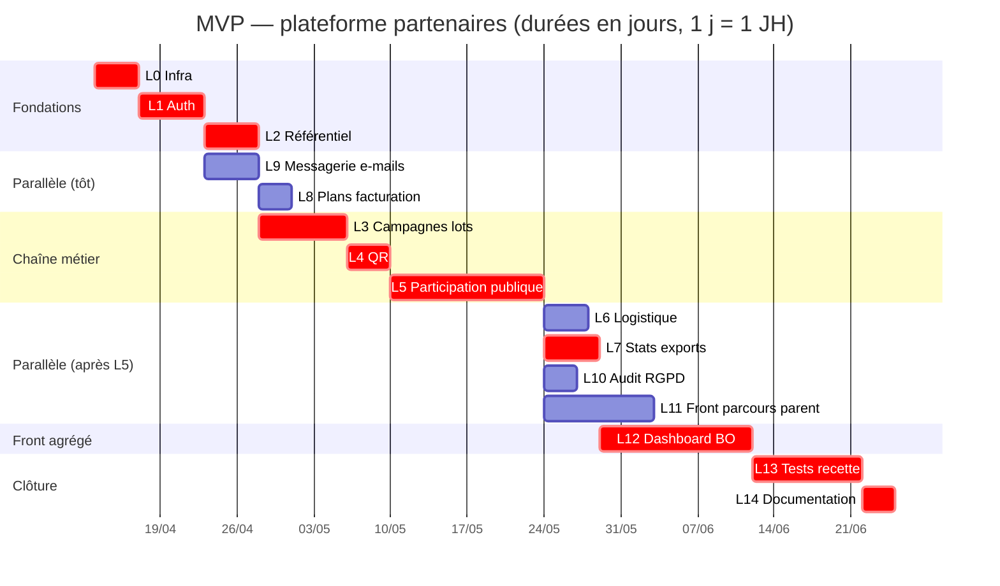

# Diagramme de Gantt — Projet plateforme partenaires (MVP)

| Document | Valeur |
| :--- | :--- |
| **Version** | 1.0 |
| **Références** | `06-Estimation-projet.md`, `07-Diagramme-PERT.md` (mêmes lots L0–L14, mêmes dépendances) |
| **Date** | 8 avril 2026 |

---

## 1. Objet et hypothèses

Le **diagramme de Gantt** positionne chaque tâche sur un **axe temps** et matérialise le **chevauchement** ou l’**enchaînement** des activités.

| Hypothèse | Détail |
| :--- | :--- |
| **Durée** | Identique au PERT : **M** en **jours-homme (JH)** par lot, traitée ici comme **durée d’affichage** « 1 JH = 1 jour » sur l’échelle du diagramme (ressource **plein temps** sur la tâche). |
| **Dépendances** | Identiques à `07-Diagramme-PERT.md` §2 (fin → début). |
| **Chemin critique** | Même chaîne qu’au PERT : **L0 → L1 → L2 → L3 → L4 → L5 → L7 → L12 → L13 → L14** (**73 JH**). Les tâches critiques sont en **rouge** (`crit`) dans le Gantt Mermaid ci-dessous. |
| **Date de début fictive** | **13 avril 2026** (lundi) — uniquement pour l’axe calendaire du rendu ; à adapter à votre planning réel. |

---

## 2. Diagramme de Gantt (Mermaid)

> Si le rendu ne s’affiche pas dans votre outil, exportez vers [Mermaid Live Editor](https://mermaid.live) ou recopiez dans un outil de gestion de projet (MS Project, GanttProject, Notion, etc.).

### Remarques de lecture

- **L12** démarre après **L7** : parmi les prédécesseurs {L5, L6, L7, L8, L9, L10}, **L7** se termine le **dernier** (jour 46 en temps projet — voir §3) ; c’est le **verrou** pour le dashboard.
- **L13** démarre après **L12** : la fin de **L11** (jour 51) précède celle de **L12** (jour 60) ; le goulot pour les tests est donc **L12**.

---

## 3. Tableau dates au plus tôt (aligné PERT)

Repère « **jour projet** » : le jour 1 est le premier jour de **L0** (équivalent au tableau « fin au plus tôt » du PERT, en cumulant les durées *M*).

| Lot | Tâche | Durée (JH) | Début (jour) | Fin (jour) |
| :--- | :--- | ---: | ---: | ---: |
| L0 | Infra | 4 | 1 | 4 |
| L1 | Auth | 6 | 5 | 10 |
| L2 | Référentiel | 5 | 11 | 15 |
| L3 | Campagnes & lots | 8 | 16 | 23 |
| L4 | QR | 4 | 24 | 27 |
| L5 | Participation | 14 | 28 | 41 |
| L6 | Logistique | 4 | 42 | 45 |
| L7 | Stats & exports | 5 | 42 | 46 |
| L8 | Plans & facturation | 3 | 16 | 18 |
| L9 | Messagerie | 5 | 11 | 15 |
| L10 | Audit & RGPD | 3 | 42 | 44 |
| L11 | Front public | 10 | 42 | 51 |
| L12 | Dashboard | 14 | 47 | 60 |
| L13 | Tests & recette | 10 | 61 | 70 |
| L14 | Documentation | 3 | 71 | 73 |

**Fin de projet (MVP)** : **jour 73** (soit **73 JH** d’effort séquentiel sur le chemin critique).

*Écart entre « début L12 = 47 » et « fin L7 = 46 » : L12 commence le jour **47**, le lendemain de la fin de L7 au jour 46.*

---

## 4. Marge sur tâches non critiques (rappel)

| Tâche | Fin au plus tôt | Marge avant goulot suivant (ordre de grandeur) |
| :--- | ---: | :--- |
| L8 | 18 | Large avant L12 (jour 47) |
| L9 | 15 | Idem |
| L6 | 45 | Fin avant L12 |
| L10 | 44 | Idem |
| L11 | 51 | **9 jours** de marge avant L13 (jour 61), car L13 attend surtout **L12** (jour 60) |

---

## 5. Lien avec estimation globale et contingence

- Le Gantt ci-dessus couvre **98 JH** de lots sans marge de sécurité globale (`06-Estimation-projet.md`).
- Avec **contingence 25 %** sur l’effort, l’équipe peut prévoir une **réserve** en fin de planning ou des **buffers** après les jalons L5, L12 et L13.

---

## 6. Historique des versions

| Version | Date | Modifications |
| :--- | :--- | :--- |
| 1.0 | 08/04/2026 | Première version — Gantt Mermaid + tableau des dates |
